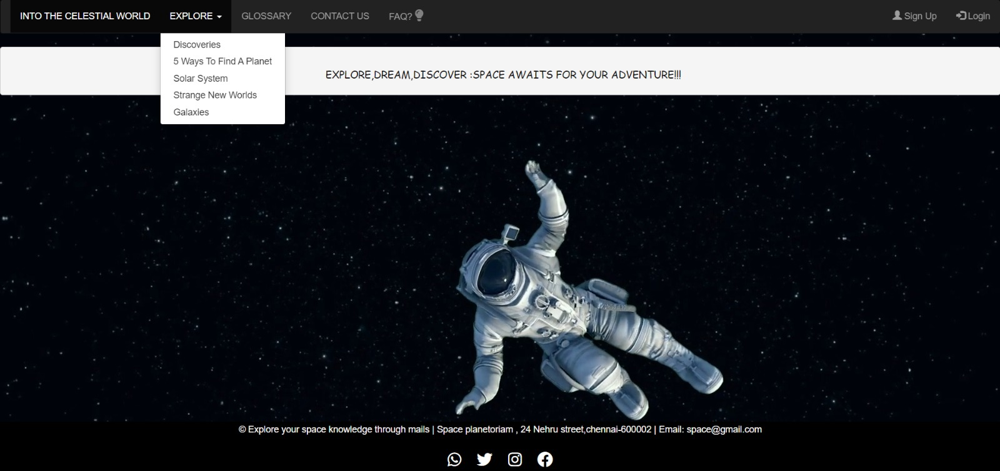

# website_into_the_celestial_world
About : A webpage using HTML,CSS and Bootstrap.

 This project is dedicated to providing a rich and educational experience about space exploration. 
 Below is a detailed overview of the content and features available on the website.

# Overview
Explore the fascinating world of planets and their discoveries, from our own Solar System to exoplanets in distant star systems.
This section provides in-depth information on each planet, including their characteristics, exploration history, and recent scientific 
findings. Discover how our understanding of these celestial bodies has evolved over time and what exciting discoveries await us in the universe.
And this website consists of some videos for better understanding.

View the webpage :

**FEATURES**

Access videos, and image that explain complex space phenomena in an easy-to-understand format.
We have also provided links to explore more.
Learn about black holes, dark matter, space weather, and the science of space travel.

**ADDITIONAL**

 Informatiom about
  + Galaxies
  + Common ways to find a planet

Do Explore all the other pages provided in our website.

“Explore our site’s universe—each page reveals a new frontier of space discovery!”
